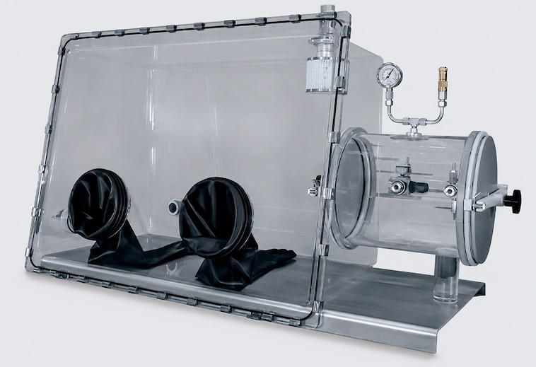

# glovebox



A Docker-based isolation harness for running AI coding agents.
Supports seven agents - **Claude Code, Codex, OpenCode, Pi, Gemini CLI,
Aider, Hermes** - each launched with `gbx run <agent>`. The image ships
only a thin wrapper binary (`gbxa`, dispatched by the agent name it's
invoked as); the real agent binary is installed on first use into a
bind-mounted state directory, so subsequent launches start instantly and
OAuth state survives container recreation. The agent runs
in a persistent container with a domain-allowlist HTTP proxy as its only
path to the internet, while interactive permission prompts inside the
agent provide the second layer of control.

The name is the lab apparatus: you reach in through sealed gloves to
manipulate something dangerous, but it can't reach out.

## Contents

- [Prerequisites](#prerequisites)
- [Install](#install)
- [Quickstart](#quickstart)
- [Commands](#commands) - full CLI reference
- [Configuration](#configuration) - auth, mounts, allowlist, state, uninstall
- [How it works](#how-it-works) - security model, networks, dev-stack internals, env vars
- [Development](#development) - building, testing
- [Maintainers](#maintainers) - release process

---

## Prerequisites

macOS or Linux with a Docker-compatible runtime installed and running. Any
of these work:
- [OrbStack](https://orbstack.dev) - recommended on macOS; what the test
  suite is exercised against.
- [Docker Desktop](https://www.docker.com/products/docker-desktop/) (macOS or Linux).
- [Colima](https://github.com/abiosoft/colima) (`brew install colima docker`).
- [Rancher Desktop](https://rancherdesktop.io) with the `dockerd (moby)` engine.
- Native [Docker Engine](https://docs.docker.com/engine/install/) on Linux
  (rootful; the daemon socket at `/var/run/docker.sock`).

## Install

### Via Homebrew

```bash
brew tap okulik/glovebox
brew trust --formula okulik/glovebox/glovebox    # brew 5.x; see below
brew install glovebox
```

`brew tap okulik/glovebox` resolves to the
[`okulik/homebrew-glovebox`](https://github.com/okulik/homebrew-glovebox)
tap repository (Homebrew inserts the `homebrew-` prefix automatically).

`brew install glovebox` then resolves to the formula from that tap as long
as no other tapped formula shares the name (homebrew-core has at the moment no other
`glovebox`). The `brew trust` step is Homebrew 5.x's opt-in for third-party
taps; without it `brew install` runs but doesn't link a `gbx` binary on
PATH.

The Homebrew install path actuall builds from source, but pulls in Go
automatically as a build-time dependency, so you don't install it yourself.

### From source

Requires Go.

```bash
git clone https://github.com/okulik/glovebox ~/dev/glovebox
cd ~/dev/glovebox
make build      # compiles bin/gbx
```

Put `bin/` on your PATH so you can drop the `bin/` prefix:

```bash
# bash
echo 'export PATH="$HOME/dev/glovebox/bin:$PATH"' >> ~/.bashrc
```

```zsh
# zsh
echo 'export PATH="$HOME/dev/glovebox/bin:$PATH"' >> ~/.zshrc
```

```bash
# fish
echo 'set -gx PATH $HOME/dev/glovebox/bin $PATH' >> ~/.config/fish/config.fish
```

## Quickstart

```bash
gbx new ~/projects/my-app         # bootstraps ~/.config/glovebox (seeds .env
                                  # from the shipped template), builds the
                                  # image on first run, creates the agent,
                                  # sets it as default (~5 min on first run)
$EDITOR ~/.config/glovebox/.env   # set the provider keys you have
gbx run pi                        # interactive Pi session
```

Any of the bundled agents works the same way:

```bash
gbx run claude
gbx run codex
gbx run opencode
gbx run pi
gbx run gemini
gbx run aider
gbx run hermes
```

Configuration and per-agent state live under `~/.config/glovebox/`.

---

## Commands

`gbx` is structured as `gbx [global-flags] <command> [subcommand] [args]`.
Run `gbx help` for an inline summary.

**Global flags**

| Flag | Purpose |
|---|---|
| `-p`, `--pid <id-or-prefix>` | Override the default project for one invocation. Prefix-resolved; ambiguous prefixes are rejected. |
| `--version` | Print the gbx version. |
| `--help` | Print help for the current command. |

### Projects

A *project* is a host workspace directory mapped to a per-project agent
container. The project id (`pid`) is the first 12 hex chars of
`sha1(realpath(workspace))`. State lives under
`~/.config/glovebox/state/projects/<pid>/`. Most of the commands below
target the default project (set by `gbx use`); pass an id, a prefix, or
use the global `-p` flag to target a non-default one.

| Command                                                       | Purpose                                                                  |
|---------------------------------------------------------------|--------------------------------------------------------------------------|
| `gbx new <path>`                                              | Register a workspace; create its agent; first project becomes the default. |
| `gbx use <id-or-prefix>`                                      | Switch the default project pointer.                                      |
| `gbx ls [-v] [--json]`                                        | List projects (`*` marks default). `-v` adds containers; `--json` emits structured output. |
| `gbx rm <id> [--delete-state] [-y]`                           | Stop and remove a project's agent. State dir kept unless `--delete-state`. |
| `gbx rm --all [--delete-state] [-y]`                          | Remove every registered project. Same state-dir rule as the single-pid form. |
| `gbx start\|stop\|restart [<id>]`                             | Per-project agent lifecycle.                                             |
| `gbx rebuild [<id>] [--all]`                                  | Rebuild `glovebox-agent:local` and recreate the agent.                   |
| `gbx rebuild --controller`                                   | Rebuild `glovebox-stack-controller:local` from source and recreate it.   |
| `gbx state-size [<id>]`                                       | Disk usage of one project plus the shared caches.                        |
| `gbx mount <subcommand>`                                      | Per-project extra bind mounts - see below.                               |
| `gbx plugin <subcommand>`                                     | Per-project Dockerfile plugins - see below.                              |

#### `gbx mount` - extra bind mounts

By default the only host directory mounted into the agent is the workspace
(`/workspace`). `mount` lets you attach additional host directories - a
sibling library, a shared docs folder, a scratch directory. The set of all
mounted directories is persisted at `~/.config/glovebox/state/projects/<pid>/mounts.txt`, one `host:container:mode` per line.

| Subcommand | Purpose |
|---|---|
| `add <host>[:<container>][:rw\|ro]` | Append a mount. Bare host → `/mnt/<basename>:rw`. |
| `rm <host-or-container>` | Drop a mount by either side. |
| `ls` | Print the current set. |
| `apply` | Force-recreate the agent so changes take effect. |

Example:

```bash
gbx mount add ~/refs/design-docs:/mnt/docs:ro
gbx mount add ~/code/shared-lib            # defaults to /mnt/shared-lib:rw
gbx mount ls
# /Users/you/refs/design-docs:/mnt/docs:ro
# /Users/you/code/shared-lib:/mnt/shared-lib:rw
gbx mount apply
gbx run -- ls /mnt/docs /mnt/shared-lib
```

Container paths claimed by the runtime (`/workspace`, `/home/gbx/.claude`,
`/home/gbx/.npm`, ...) are refused to avoid shadowing agent state. Host paths
are symlink-resolved so the on-disk record matches what Docker actually
mounts. Changes take effect on the next `gbx mount apply` (or the next
`gbx rebuild` / `gbx new`).

#### `gbx plugin` - custom image content

The agent image is shared across projects. To add project-specific tools or
packages without forking the base Dockerfile, use plugins - Dockerfile
fragments layered on top of the base image.

```sh
gbx plugin add            # opens $EDITOR with an instructional template
gbx plugin ls             # list this project's plugins
gbx plugin edit <id>      # edit a fragment
gbx plugin rm <id>        # remove a fragment
gbx rebuild               # builds glovebox-agent-<pid>:local and recreates the container
```

Each fragment must start with a comment `# gbx:description:` followed with a description:

```dockerfile
# gbx:description: install httpie and ripgrep
RUN uv tool install httpie
```

Rules: no `FROM` line (it is generated for you) and no `ADD` (use `COPY` or
`RUN curl`). The build runs as root; the container still runs as the `gbx`
user. A project with no plugins keeps running the shared base image.

Plugin changes apply only on the next `gbx rebuild`: `add` and `edit` alone
change nothing at runtime, and removing the last plugin does NOT revert the
project to the base image on a plain `gbx start`/`restart` - the stale
`glovebox-agent-<pid>:local` image is only dropped when you run `gbx rebuild`.

### `gbx run` - work in a project's agent

| Form | Purpose |
|---|---|
| `gbx run` | Bash shell inside the default project's agent. |
| `gbx run -- <cmd...>` | One-shot command inside the agent. |
| `gbx run <agent> [args...]` | Launch one of the bundled agents: `claude`, `codex`, `opencode`, `pi`, `gemini`, `aider`, `hermes`. The agent's own flags pass through unchanged. |

Example:

```bash
gbx run                          # interactive bash shell in the agent
gbx run -- npm test              # one-shot command; exits with its status code
gbx run -- ls /workspace /mnt    # peek at mounts without opening a shell
gbx run claude                   # launch the bundled Claude Code agent
gbx run codex --help             # an agent's own flags pass straight through
gbx -p 1a2b3c run -- pytest -q   # target a non-default project by pid prefix
```

The command runs as the in-container user against `/workspace`, brings the
shared stack up first if needed, and creates the project's agent container on
first use. Without `-p`, it targets the active project that `gbx use` set.

### `gbx update <agent>` - refresh an agent in place

Reinstalls a bundled agent at its latest published version inside the
container. Per-agent state in `state/<agent>/` is preserved.

Example:

```bash
gbx update claude                # reinstall Claude Code at its latest version
gbx update aider                 # any bundled agent: claude codex opencode pi gemini aider hermes
gbx -p 1a2b3c update gemini      # update the agent in a specific project's container
```

The resolved install command (npm / uv) is echoed to stderr before it runs,
and like `gbx run` the target defaults to the active project unless `-p` is
given.

### `gbx export-conversations` - surface sandbox chats to host viewers

Surfaces the agent conversation logs written *inside* the sandbox at the
host locations that desktop viewers (AgentsView and friends) already scan.
The logs aren't hidden - glovebox bind-mounts each agent's home
(`~/.claude`, `~/.codex`, ...) from `state/projects/<pid>/<agent>/`, so they
persist on disk. But every sandbox runs with `cwd=/workspace`, and viewers
derive a session's project from its recorded working directory - so left as-is
every glovebox project collapses into one ambiguous `workspace` project.

This command copies each session into the viewer's native directory and
**rewrites the recorded cwd** to a synthetic, glovebox-tagged path
`.../gbx-<pid>-<name>`. The viewer then shows it as a distinct project named
`gbx_<pid>_<name>` - obviously glovebox, unique per project (collision-proof
even if two projects ran from the same host workspace), and sitting beside the
real one. For a workspace `~/dev/projects/gwook` and pid `030d91f1f47b`:

```
~/.claude/projects/-Users-you-dev-projects-gbx-030d91f1f47b-gwook/<session>.jsonl
   → shows in AgentsView as project  gbx_030d91f1f47b_gwook
```

Copies are standalone (only the cwd field is touched; other `/workspace`
mentions are left as the agent saw them). Re-running is idempotent - it
refreshes the copies to pick up new turns, and drops any earlier export of the
same project (from an older naming scheme, say) so a viewer that dedups by
session id never keeps showing a stale copy.

| Flag | Purpose |
|---|---|
| `--all` | Export every registered project (default: the active / `-p` project). |
| `--harness <name>` | Limit to one harness (`claude`, `codex`, ...). Default: all. |
| `--dest <dir>` | Override the destination root (requires `--harness`). |

```bash
gbx export-conversations --all      # every project, all harnesses → ~/.claude, ...
gbx -p 1a2b3c export-conversations  # just one project
```

Then point AgentsView at `~/.claude`; the exported chats appear as
`gbx_<pid>_<name>` projects alongside your native ones. Because the copies are
self-contained, they also survive `gbx rm --delete-state` - after the state dir
is gone they are the only remaining record of those sessions.

> Only **Claude Code** export is implemented today. The other bundled harnesses
> (codex, gemini, opencode, aider, pi, hermes) are recognized but skipped with a
> notice - they store sessions differently and each needs its own mapping.

### `gbx logs [proxy|controller]` - tail a stack component

Streams a singleton-stack component's logs to your terminal (follows live):

| Target | Stream |
|---|---|
| `proxy` (default) | The shared egress-proxy (Squid) access log - every allowed/blocked CONNECT. |
| `controller` | The `stack-controller` HTTP server's stdout/stderr - manifest applies, image pulls, reconcile and request logs. |

```bash
gbx logs                  # same as `gbx logs proxy`
gbx logs controller       # watch the stack-controller while debugging `gbx stack apply`
```

`controller` is the place to look when a `gbx stack apply` is rejected or a
service won't come up: the controller logs the validation failure, pull
error, or healthcheck timeout that the apply rolled back on.

### `gbx allow <domain>` - extend the egress allowlist

Appends a domain to `~/.config/glovebox/allowlist.txt` and sends `SIGHUP`
to Squid so the entry takes effect immediately (no restart). Lines that
start with `.` match the domain and any subdomain.

The fastest path when something is blocked:

```bash
gbx logs proxy &              # tail in a side terminal
# reproduce the failure
gbx allow some-host.example
```

A blocked CONNECT returns HTTP `451 Unavailable For Legal Reasons` with an
`X-Glovebox-Egress: blocked; reason=domain-not-allowlisted; add-via='gbx allow <domain>'`
response header - two distinct signals that agents (and humans) can use to
tell a sandbox block apart from an origin's own 4xx. The on-disk agent
instructions injected into each project's `CLAUDE.md` / `AGENTS.md` /
`GEMINI.md` already include the convention so the agent reacts correctly.

### `gbx stack` - per-project dev services

A project can declare auxiliary services (Redis, Postgres, Neo4j, …) via
a stack manifest. The agent proposes; the operator approves and applies.
Approved services come up on a per-project `internal: true` network
(`glovebox-stack-<pid>`), which the agent joins on apply, so DNS names
like `redis:6379` resolve from inside the agent.

All stack subcommands except `ls` and `image-allow` target a project; select
it with the global `-p <id>` flag (placed before the subcommand), the
`GBX_PROJECT_ID` env var, or fall back to the active project set by `gbx use`.

| Subcommand | Purpose |
|---|---|
| `apply [--dry-run] [-y]` | Apply the controller's stored proposed manifest. |
| `diff` | Show live vs proposed manifest. |
| `down` | Stop services; keep volumes. |
| `destroy [-y]` | Stop + remove services and volumes. |
| `status` | Show service health. |
| `ls` | List projects that have stacks. |
| `logs <svc> [--follow]` | Stream a service's logs. |
| `image-allow <registry>` | Append a registry to `docker/image-allowlist.txt`. |

Example - approving and operating a stack the agent proposed:

```bash
# The agent ran `gbx-stack propose <file>`, submitting the manifest to the
# controller.  No workspace file is written.  Review and apply from the host:

gbx stack diff                                  # review proposed vs live
gbx -p 1a2b3c4d5e6f stack apply -y              # validate, pull, start, attach agent

gbx -p 1a2b3c4d5e6f stack status               # service health
gbx -p 1a2b3c4d5e6f stack logs redis --follow
gbx stack ls                                    # every project that has a stack

# Tear down when finished:
gbx -p 1a2b3c4d5e6f stack down                 # stop services, keep volumes
gbx -p 1a2b3c4d5e6f stack destroy -y           # also remove named volumes
```

`apply` and `destroy` prompt `[y/N]` before acting; pass `-y` to skip the
prompt (required when stdin isn't a terminal). `gbx stack apply --dry-run`
prints the manifest that would be sent without contacting the controller.
When no project resolves (no `-p`, no `GBX_PROJECT_ID`, no active project)
these commands error rather than guessing.

The agent observes and operates the live stack via a separate in-container
CLI, `gbx-stack` - see [Dev stack details](#dev-stack-details).

---

## Configuration

### Auth: API keys vs login

Each agent looks at a different set of provider keys. The simplest path is
to drop keys into `~/.config/glovebox/.env` - they are passed through to the
container's environment, where the agents pick them up:

```
ANTHROPIC_API_KEY=    # Claude, Aider, OpenCode, Hermes, Pi
OPENAI_API_KEY=       # Codex, Aider, OpenCode, Hermes, Pi
OPENROUTER_API_KEY=   # Aider, OpenCode, Hermes, Pi
GOOGLE_API_KEY=       # Gemini CLI, Aider, Pi (default provider)
DEEPSEEK_API_KEY=     # Aider, Pi
GROQ_API_KEY=         # Aider, Pi
MISTRAL_API_KEY=      # Aider, Pi
```

For agents that prefer OAuth (Claude Code, Codex, OpenCode, Gemini CLI,
Hermes), use the agent's native login command from within the container.
Credentials land in `~/.<agent>/` which is bind-mounted to `state/<agent>/`,
so they survive container recreation.

```bash
gbx run claude              # then run /login from inside Claude
gbx run codex login
gbx run opencode auth login
gbx run gemini
gbx run hermes login
```

`gbx run -- agent-auth` shows a status table for every agent (env / oauth /
none) - useful for confirming a setup is wired correctly.

### State directories

Everything under `~/.config/glovebox/state/` is bind-mounted into the agent
and survives container restarts.

Per-project state lives at `state/projects/<pid>/`:

| Path | Purpose |
|------|---------|
| `claude/` | Claude Code config, login, projects, history |
| `codex/` | Codex config and OAuth credentials |
| `opencode/` | OpenCode config and provider login state |
| `pi/` | Pi config (sessions, skills, extensions) |
| `gemini/` | Gemini CLI config and auth state |
| `aider/` | Aider config, cache, `.aider.*` history files |
| `hermes/` | Hermes config, sessions, logs, skills, .env |
| `workspace-path` | Pointer to the host workspace |
| `mounts.txt` | Extra bind mounts added with `gbx mount` |

Shared caches live at `state/shared/`:

| Path | Purpose |
|------|---------|
| `npm/` | npm cache |
| `uv-tools/` | uv tool environments (aider) |
| `bin/` | uv-managed binaries (aider) |
| `cache/` | pip / uv build caches |
| `shell-history/` | bash history (debug aid) |

`gbx rebuild` recreates a project's agent container from a fresh
image without touching this state. For a project with plugins it also
builds or refreshes the derived `glovebox-agent-<pid>:local` image (base
image + the project's fragments); for a project with none it drops any
stale derived image so the container reverts to the base image. That
revert happens only on `gbx rebuild` - removing the last plugin does not
change a running or restarted container until you rebuild. `gbx rm <id>`
removes only the container by default; pass `--delete-state` to also wipe
the per-project directory.

`gbx rebuild --controller` is the control-plane equivalent: it
rebuilds the singleton `glovebox-stack-controller:local` image from
current source and recreates its container. `gbx up` won't do this on
its own - it skips the build once the image exists - so reach for
`--controller` after changing controller code (e.g. adding an API
route). Project services and agents keep running; only the controller
API blips during the ~30s rebuild, and `state/controller/` is
preserved.

### Allowlists at a glance

Two distinct files with two distinct purposes:

| File | Used by | Gates |
|---|---|---|
| `~/.config/glovebox/allowlist.txt` | `egress-proxy` (Squid) | Outbound HTTPS from the agent (`gbx allow`) |
| `docker/image-allowlist.txt` | `stack-controller` | Image registries for `gbx stack apply` pulls |

The egress allowlist hot-reloads on `SIGHUP`. The image allowlist requires
a controller restart (`docker restart glovebox-stack-controller`, or the
next time `gbx up` brings the stack up). Lines beginning with `.` in the
egress allowlist match a domain and any subdomain; both files ignore `#`
comments and blank lines.

### Singleton stack control

`gbx up` (idempotent) ensures the shared three-container stack -
egress-proxy, socket-proxy, stack-controller - is healthy. Every command
that needs it (`gbx new`, `gbx run`, `gbx start`, …) calls it
automatically; you only invoke it directly for operator sanity checks or
after a manual `docker stop` of the stack containers.

### Uninstall

```bash
gbx rm <id>            # one project's agent + state
make uninstall         # hard reset: every glovebox container, the
                       # agent image, and ~/.config/glovebox
                       # (prompts unless FORCE=1)
```

If you installed via Homebrew (no Makefile available), run the equivalent
commands by hand:

```bash
docker container ls -a --filter name='^glovebox-' --format '{{.Names}}' | xargs -r docker rm -f
docker network  ls    --format '{{.Name}}' | grep '^glovebox' | xargs -r -I {} docker network rm {}
docker volume   ls    --format '{{.Name}}' | grep '^glovebox' | xargs -r docker volume rm
docker image    rm glovebox-agent:local
rm -rf ~/.config/glovebox
```

---

## How it works

### Security model

The container is the outer safety net. Interactive permission prompts
inside the agent are the inner one. Specifically:

1. The work container has **no default route to the internet** - it sits
   on a Docker `internal: true` network whose only outside-facing member
   is the proxy.
2. The proxy permits only HTTPS CONNECT to domains in `allowlist.txt`.
   Plain HTTP and non-HTTPS CONNECTs are denied.
3. The container runs as **your host user's UID/GID** (derived from
   `os.Getuid()` / `os.Getgid()` at image-build and container-create time)
   with `cap_drop: [ALL]` and `no-new-privileges`. Files written to
   `/workspace` appear owned by you on the host - on macOS via the Docker
   file-sharing layer, on native Linux because the container UID matches
   your host UID directly.
4. The harness **does not pass `--dangerously-skip-permissions`**.
   Approve tool calls in the usual agent prompts.

Re-run the suite at any time to confirm these properties hold:

```bash
make test
```

### Network topology

Four bridge networks separate the components. Only one of them
(`glovebox-egress`) can reach the internet; the other three are
`internal: true`. The agent's only outbound paths are to the egress
proxy (via `HTTPS_PROXY`) and to the stack-controller's `:7000` API.

```
   host (macOS / Linux)
   ────────────────────
     /var/run/docker.sock              127.0.0.1:7001
              │                                │
              │ RO bind                        │ host-only listener
              ▼                                ▼

   ┌─ glovebox-control   (internal) ─────────────────────────────────┐
   │                                                                 │
   │    socket-proxy   ◄── tcp/2375 ──   stack-controller            │
   │                                                                 │
   └─────────────────────────────────────────────────────────────────┘

   ┌─ glovebox-internal  (internal) ─────────────────────────────────┐
   │                                                                 │
   │    stack-controller  ◄─ /api ─  agent  ─ HTTPS_PROXY ─► egress- │
   │           :7000                                          proxy  │
   │                                                                 │
   └─────────────────────────────────────────────────────────────────┘

   ┌─ glovebox-egress    (has internet) ─────────────────────────────┐
   │                                                                 │
   │    stack-controller    egress-proxy  ─► HTTPS (Squid allowlist) │
   │           │                                                     │
   │           └──► image registries (pulls at apply time)           │
   │                                                                 │
   └─────────────────────────────────────────────────────────────────┘

   ┌─ glovebox-stack-<pid>   (internal, one per project) ────────────┐
   │                                                                 │
   │    agent  (attached on `gbx stack apply`)                       │
   │       │                                                         │
   │       ▼                                                         │
   │    redis    neo4j    postgres    …    (services from manifest)  │
   │                                                                 │
   └─────────────────────────────────────────────────────────────────┘
```

Membership at a glance:

| Container          | control | internal | egress | stack-`<pid>` |
|--------------------|:-:|:-:|:-:|:-:|
| `socket-proxy`     | ✓ |   |   |   |
| `stack-controller` | ✓ | ✓ | ✓ |   |
| `egress-proxy`     |   | ✓ | ✓ |   |
| `agent`            |   | ✓ |   | ✓ (after apply) |
| stack services     |   |   |   | ✓ |

The `socket-proxy` container runs
[`tecnativa/docker-socket-proxy`](https://github.com/Tecnativa/docker-socket-proxy),
a small HTTP daemon that read-only-mounts the host's
`/var/run/docker.sock` and re-exposes it as `tcp://socket-proxy:2375`,
filtered to a per-endpoint allowlist. Only `CONTAINERS`, `NETWORKS`,
`VOLUMES`, `IMAGES`, `VERSION`, and `POST` are enabled; `EXEC`, `AUTH`,
`SECRETS`, `SERVICES`, `SWARM`, `SYSTEM`, and `INFO` are off. It is the
controller's only path to the Docker daemon - the controller never gets
the raw socket - so even a fully compromised controller can't shell
into containers, read secrets, or touch swarm state.

Key properties this enforces:

- The **agent** has no path to the Docker socket - `socket-proxy` lives
  only on `glovebox-control`, which the agent never joins.
- The **agent** has no direct internet route - the only egress path is
  through `egress-proxy`'s HTTPS allowlist.
- **Stack services** have no internet at all - `glovebox-stack-<pid>`
  is `internal: true` and they're the only members along with the
  attached agent.
- The **stack-controller** is the only container straddling control,
  internal, and egress. Image pulls happen on `glovebox-egress` from
  the controller, never from the agent.

### Multi-project layout

Glovebox derives a 12-character project ID from the canonical workspace
path (`sha1(realpath(path))[:12]`) and uses it to namespace the agent
container (`glovebox-agent-<pid>`), the stack network
(`glovebox-stack-<pid>`), and the per-project state directory
(`state/projects/<pid>/`).

```bash
gbx new ~/projects/app-a    # creates agent for A; sets as default
gbx new ~/projects/app-b    # creates agent for B; A keeps running, default unchanged
gbx use <b-pid>             # switch default to project B
gbx run claude              # routes to project B (default)
gbx -p <a-pid> run claude   # routes to project A without changing default
gbx ls                      # lists projects, agents, stacks
gbx rm <id>                 # stops + removes a project's agent and state
```

Shared caches (`npm`, `uv-tools`, build caches, shell history) live under
`state/shared/` and are bind-mounted into every project's agent.

### Dev stack details

The dev-stack workflow:

1. The agent writes a draft and runs `gbx-stack propose <file>`, which
   POSTs the manifest to the controller and prints an operator hint.  No
   workspace file is written.
2. The operator reviews via `gbx stack diff [-p <id>]`, then
   `gbx stack apply [-p <id>] -y`.  The host CLI applies the
   controller's stored proposal.
3. The controller validates the manifest (registry allowlist, safe-cap
   allowlist for `cap_add`, no host-bind volumes, resource caps), pulls
   images, creates `glovebox-stack-<project>` (internal), starts services,
   and waits for healthchecks. Any failure rolls back fully.
4. The agent runs `gbx-stack wait` and then talks to services by name
   (`redis:6379`, `neo4j:7687`, …).

The agent learns this workflow from two complementary files in
`defaults/`:

- `docker-sandbox.md` - the long-form operating manual (this whole
  `gbx-stack` flow, manifest constraints, `cap_add` allowlist, etc.). It
  is bind-mounted read-only into the container at
  `/etc/glovebox/docker-sandbox.md`, so any host-side edit is visible
  to the agent immediately, no restart required.
- `proxy-sandbox.md` - the long-form operating manual for handling the
  egress 451 error. Also bind-mounted read-only into the container at
  `/etc/glovebox/proxy-sandbox.md`.
- `agent-instructions.md` - a short, ~25-line summary that names
  the Docker sandbox and teaches the agent the egress 451. It's injected
  into each agent's conventional instruction file on every `agent.Ensure`
  pass - i.e. on `gbx new`, `gbx start`, `gbx mount apply`, `gbx rebuild`,
  … - specifically into `state/<pid>/claude/CLAUDE.md`,
  `state/<pid>/codex/AGENTS.md`, and `state/<pid>/gemini/GEMINI.md`.
  It references `docker-sandbox.md` and `proxy-sandbox.md` files containing
  more comprehansive explanations - all of which are lazily included into
  the context.

The injection is wrapped in HTML-comment markers
(`<!-- glovebox-instructions-begin -->` … `<!-- glovebox-instructions-end -->`):
the content *between* markers is refreshed each pass (so changes to the
summary land on next ensure), the content *outside* the markers (user
notes, project rules) is preserved verbatim. If the target file already
contains the markers, the block is replaced in place; if it lacks them,
the block is appended; if the file doesn't exist, it's created. Writes
are atomic and skipped entirely when the resulting bytes match what's
already on disk.

#### Agent CLI (`gbx-stack`, in-container)

| Command | Purpose |
|---|---|
| `gbx-stack status` | Print health summary. |
| `gbx-stack info` | JSON service map. |
| `gbx-stack wait` | Block until services are healthy. |
| `gbx-stack start <svc>` | Start a service from the live manifest. |
| `gbx-stack stop <svc>` | Stop a service. |
| `gbx-stack reset <svc>` | Wipe a service's volumes and restart. |
| `gbx-stack logs <svc> [--follow]` | Stream a service's logs. |
| `gbx-stack propose <file>` | Submit `<file>` as the proposed manifest (POST to controller). |
| `gbx-stack diff` | Show live vs proposed. |

The agent's power stops at the live manifest: it can start, stop, and
reset services that were already approved, but it cannot add new ones
without the operator running `gbx stack apply` again.

#### Manifest fields

A service entry may set:

| Field | Purpose |
|---|---|
| `image` | Fully tagged image (no `:latest`); registry must be on the allowlist. |
| `env` | Map of env vars; `${FOO}` references must be on the env allowlist. |
| `volumes` | Named volumes only (`<name>: <container-path>`); host binds rejected. |
| `healthcheck` | Compose-style `test` / `interval` / `retries` / `timeout`. |
| `resources` | `cpus` and `memory` caps, bounded by controller limits. |
| `cap_add` | Linux caps to grant on top of the minimum set; safe allowlist only. |

The safe-cap allowlist for `cap_add` is `IPC_LOCK`, `SYS_NICE`,
`SYS_RESOURCE`, `DAC_READ_SEARCH`. Anything else (e.g. `NET_ADMIN`,
`SYS_ADMIN`, `SYS_PTRACE`) is rejected at apply time.

#### Example

Example manifest draft (e.g. `/tmp/stack.yml`):

```yaml
version: 1
services:
  redis:
    image: redis:7-alpine
    volumes:
      data: /data
  neo4j:
    image: neo4j:5
    cap_add: [IPC_LOCK]
    volumes:
      data: /data
```

From inside the agent, after the operator has applied it:

```bash
gbx-stack wait
python -c "
import redis
r = redis.Redis(host='redis', port=6379)
r.set('hello', 'world')
print(r.get('hello'))
"
gbx-stack reset redis   # clear data between test runs
```

#### How `gbx stack apply` works under the hood

`gbx stack apply` is a thin host-side wrapper. The interesting work
happens in the `stack-controller` (Go, `docker/stack-controller/`). On
`POST /projects/<pid>/apply` it does this, in order:

1. **Validate the manifest** against the schema and policy rules
   (`internal/manifest/`): strict YAML decoding rejects unknown fields,
   image registries must be on the allowlist, image tags must be present
   and not `:latest`, volumes must be named (no host binds), `env`
   references must match the env-var allowlist, `cap_add` entries must
   be in the safe-cap allowlist, and `resources.cpus` / `resources.memory`
   must fit the controller's caps (4 CPUs, 8 GiB by default). A
   validation failure returns a structured error with a `HintForAgent`
   field surfaced via `gbx-stack wait`.

2. **Plan Docker resources** (`internal/dockerx/compose.go`): the
   manifest is translated into concrete specs:

   | Resource  | Naming convention                                   |
   |-----------|-----------------------------------------------------|
   | Network   | `glovebox-stack-<pid>` (`internal: true`)           |
   | Container | `glovebox-stack-<pid>-<svc>` with DNS alias `<svc>` |
   | Volume    | `glovebox-stack-<pid>-<svc>-<name>`                 |

   Healthchecks come from the manifest if declared; otherwise the
   controller injects a per-image default (`redis-cli ping`,
   `pg_isready`, `mysqladmin ping`, `rabbitmq-diagnostics ping`,
   `wget http://localhost:7474/` for neo4j). Anything not on that list
   gets no healthcheck and is treated as ready on `running`.

3. **Acquire a per-project mutex** so two concurrent applies for the
   same `pid` serialize cleanly. Different projects don't block each
   other.

4. **Walk the Docker API** through `socket-proxy`
   (`tcp://socket-proxy:2375`, on `glovebox-control` only - the agent
   has no path there):

   1. `EnsureNetwork(glovebox-stack-<pid>, internal=true)`.
   2. `EnsureVolume(...)` for each named volume.
   3. `PullImage(...)` for each new container - pulls go out via
      `glovebox-egress` since the controller is on it.
   4. `CreateContainer(...)` with the planned name, DNS alias, env,
      named-volume mounts, healthcheck, resource caps, and minimum
      capability set plus any allowed `cap_add`.
   5. `StartContainer(...)`.

5. **Block on healthchecks** by polling each container's
   `Health.Status` until it's `healthy` (or empty, meaning no
   healthcheck → treated as ready). Default budget is 60 s; failure
   triggers rollback.

6. **Attach the agent** to the project network with
   `ConnectNetwork(glovebox-agent, glovebox-stack-<pid>)` so service
   DNS names resolve from inside the agent. Done after healthchecks so
   a failed apply doesn't leave the agent's endpoint blocking the
   rollback's `RemoveNetwork`.

7. **Persist the live manifest** plus a `last_apply: {status, reason,
   time}` record to `state/controller/projects.json` (atomic tempfile +
   rename, mutex-guarded).

8. **Return 200** with `{status: "applied", project_id, network,
   services}`.

**Rollback** is transactional. Each successful create is recorded in an
`undo` struct; any later failure unwinds in reverse order (containers →
volumes → network). The persisted `last_apply` records the rollback
reason so `gbx-stack wait` can surface "rejected" or "rolled_back"
instead of timing out blindly.

**Reconcile on startup** (`internal/state/reconcile.go`): when the
controller boots, it walks every record in `projects.json` and re-creates
anything missing - network, volumes, and stopped/deleted containers -
then re-attaches `glovebox-agent` to each project's network. So a
`docker rm`'d service or a host reboot doesn't lose state; running `gbx
project start` or other per-project commands will bring everything back
to the intended shape.

### Environment variables

Most of these are resolved automatically - by the `gbx` binary, by the
Homebrew wrapper, or by code that runs inside the agent container. The
ones worth knowing about as a user are at the top; the rest are
documented for the rare time you need to override them.

#### User-facing

| Variable | Purpose | Default |
|---|---|---|
| `GBX_CONFIG_DIR` | Where `.env`, `allowlist.txt`, the `active-project` pointer, and `state/` live. Override to keep multiple unrelated glovebox setups on one host. | `~/.config/glovebox` |
| `GBX_CONTROLLER_HOST_PORT` | Host-side port forwarded to the stack-controller's `:7001` listener. Change if `17001` collides with something. | `17001` |
| `GBX_WAIT_TIMEOUT_S` | Seconds `gbx-stack wait` will poll before giving up. | 1800 |
| Provider keys (`ANTHROPIC_API_KEY`, `OPENAI_API_KEY`, …) | Forwarded into the agent container at create time so the agent CLIs can authenticate. Edit `${GBX_CONFIG_DIR}/.env`. | - |

#### Set inside the agent container

`gbx` injects these so in-container tools (`gbxa`, `gbx-stack`, agent
code) know which project they belong to. You usually only see them when
debugging from a shell inside the container.

| Variable | Purpose |
|---|---|
| `GBX_PROJECT_ID` | The 12-char pid of the project this container serves. |
| `GBX_PROJECT_DIR` | The workspace path mounted at `/workspace`. |
| `GBX_CONTROLLER_URL` | Stack-controller URL (`http://stack-controller:7000` over the internal network). |

#### Internal / advanced

You only need to override these if you're hacking on glovebox itself.

| Variable | Purpose |
|---|---|
| `GBX_LIBEXEC` | Path to the package files (`docker/`, `defaults/`, `.env.example`). Auto-resolved from the binary's directory; Homebrew sets it explicitly. |
| `GBX_STATE_DIR` | Override the state subdir. Default is `${GBX_CONFIG_DIR}/state`. |
| `GBX_AGENT_IMAGE` | Image tag every project's agent container is built from and run against. Default `glovebox-agent:local`. The rebuild test points this at a throwaway tag (`glovebox-agent-test-aad-$$:local`) so it can't untag the operator's real image. |
| `GBX_TEST_MODE` | When `1`, every agent container `gbx` creates carries the `io.glovebox.test=1` label. `make clean-tests` (and the bash suite's pre-flight) wipe by that label, no matter what happened to the state dir or workspace dir. Exported automatically by `tests/test_helper.sh`. |
| `GBX_OVERRIDE_PID` | Set transparently by `gbx -p <pid> <cmd>`; downstream code routes to that project for the one invocation. |
| `GBX_SKIP_STACK_UP` | When `1`, `gbx new` skips bringing the singleton stack up. Used by tests that inject a fake EnsureAgent. |
| `GBX_TESTS_STACK_ALREADY_UP` | When `1`, each test file's `stack_up` helper short-circuits because the outer parallel runner already brought the stack up. |

---

## Development

### Make targets

`make help` lists everything; the table below summarises the most-used
targets. Many also accept env-var overrides (`FILE=`, `WORKERS=`, `BUMP=`,
`FORCE=`).

| Target                                          | Purpose                                                                  |
|-------------------------------------------------|--------------------------------------------------------------------------|
| `make build`                                    | Compile `bin/gbx` from `cmd/gbx`.                                        |
| `make man`                                      | Regenerate `share/man/man1/gbx.1` from `docs/gbx.1.md` (needs `go-md2man`). |
| `make test`                                     | Run the bash integration suite. `FILE=` filters to one or more test files. |
| `make test-go`                                  | Run the Go unit-test suite (`go test ./...`).                            |
| `make test-all`                                 | `test-go` + `test` - the pre-push gate.                                  |
| `make test-parallel`                            | Shard the bash suite across `WORKERS=2` subprocesses (≈3× faster).       |
| `make lint`                                     | gofmt check, `go vet`, and golangci-lint.                                |
| `make clean`                                    | Remove `bin/gbx`, the generated man page, and stale `.test-config*` dirs. |
| `make clean-tests`                              | Wipe test Docker residue (labeled containers, TMPDIR agents, dangling stack nets / images / volumes). Never touches real projects. |
| `make release`                                  | Bump `version.txt`, commit, tag locally. `BUMP=patch\|minor\|major` (default: re-tag current). |
| `make uninstall`                                | Hard reset: every glovebox container, image, and `${GBX_CONFIG_DIR:-~/.config/glovebox}`. Prompts unless `FORCE=1`. |

### Running tests

The bash integration suite is implemented as a pure Bash runner (no Bats
dependency). It exercises the host CLI end-to-end against real Docker
containers, so it expects OrbStack to be running.

#### Single file

```bash
./scripts/run-tests.sh tests/41-wrapper-cd.sh
make test FILE=tests/41-wrapper-cd.sh
```

You can also pass multiple files:

```bash
./scripts/run-tests.sh tests/41-wrapper-cd.sh tests/43-wrapper-run.sh
make test FILE="tests/41-wrapper-cd.sh tests/43-wrapper-run.sh"
```

#### Parallel suite

`make test-parallel` runs the parallel-safe test files across `WORKERS=2`
subprocesses (each with its own `GBX_CONFIG_DIR=.test-config.wN`), then
runs the must-serial bucket - tests that mutate singleton stack state or
talk to the controller - sequentially against the shared config dir. The
singleton stack is brought up once at the suite boundary instead of
per-file. Net runtime is ~3× faster than `make test` (≈7 min vs ≈20 min
on a clean M-series Mac).

```bash
make test-parallel              # WORKERS=2 (the empirical sweet spot)
WORKERS=4 make test-parallel    # faster but hits OrbStack daemon contention; expect failures
```

---

## Maintainers

### Publishing a Homebrew release

The canonical formula lives in the dedicated tap repo,
[`okulik/homebrew-glovebox`](https://github.com/okulik/homebrew-glovebox),
as `Formula/glovebox.rb` (the copy in this repo is a non-authoritative
reference). It installs from the tagged release tarball pinned by its
`url`, `sha256`, and `version` lines. To cut a new version:

1. In this repo, tag and push:
   ```bash
   git tag v0.1.0
   git push origin v0.1.0
   ```
2. Compute the sha256 of the release tarball GitHub creates automatically:
   ```bash
   curl -sL https://github.com/okulik/glovebox/archive/refs/tags/v0.1.0.tar.gz \
     | shasum -a 256
   ```
3. In the tap repo's `Formula/glovebox.rb`, update the `url`, `sha256`, and
   `version` lines to match the new tag, then commit and push.

The formula also carries a `head` spec (latest `main`) for anyone who wants
to track development with `brew install --HEAD glovebox`.

### Refreshing an install after pushing a new release

After bumping the formula, users pick up the new version with:

```bash
brew update
brew upgrade glovebox
```

A HEAD install is the exception - the version string doesn't change, so
`brew upgrade` reports "already installed" and skips the rebuild. Force it
to fetch the new commit:

```bash
brew upgrade --fetch-HEAD glovebox
# or, equivalently:
brew reinstall --HEAD glovebox
```

Confirm the formula commit brew will pull matches your local push with
`git -C <repo> log -1 --oneline Formula/glovebox.rb` before reinstalling.

---

## Licence

Licensed under [AGPL-3.0-or-later](LICENSE). © 2026 Orest Kulik.
